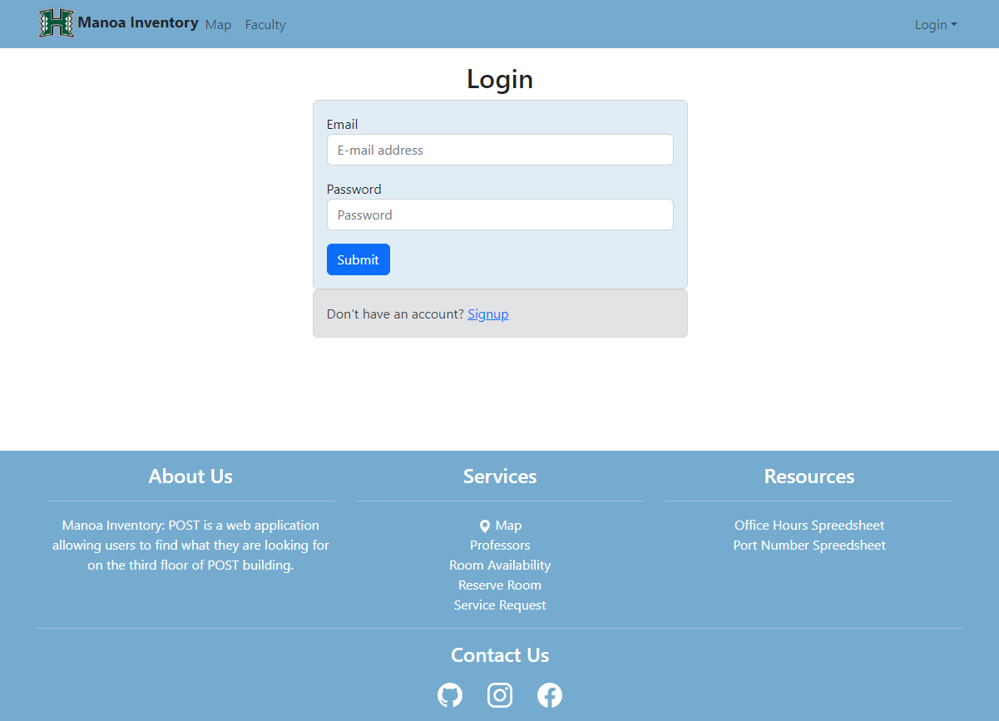
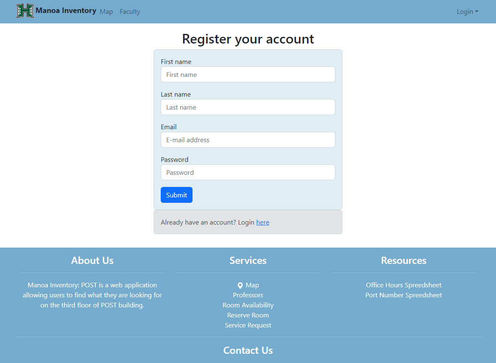
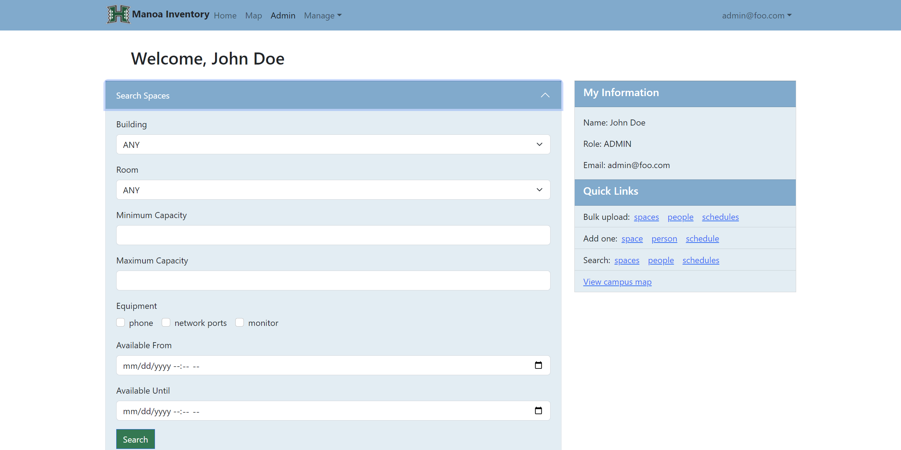

# Manoa Inventory: POST

## GitHub Repository
[Repository Link](https://github.com/Manoa-Inventory-POST/manoa-inventory-post)

## Table of contents
* [Overview](#overview)
* [User Stories](#user-stories)
* [Team](#team)

## Overview
Manoa Inventory: POST is a web application allowing users to find what they are looking for on the third floor of POST building. Students will be able to locate where they may attend the class and provide a list of all office hours to use. TA's, RA's, faculty, and advisors will be able to sign up and request for a room to use. Student may request a room to use under permission. Office staff and IT support will be able to keep track of which rooms are in use and what type of equipment can be found in these rooms.

## User Stories Designs

### User Story #1

As an office worker, I want to reallocate an occupant to a different room.

### User Story #2

As a tech support person, I want to generate a list of all functional ports and the rooms they are located in.

### User Story #3

As a faculty member (or TA/RA) I want to be able to search for an available classroom by date/time, building, floor, and/or equipment, and reserve it if it meets my specifications.

### User Story #4

As an undergraduate student I want to be able to look up my professor by name to find out his or her office hours and location. Need an approval from my advisor.

### User Story #5

As a graduate student, I wish to check which room will be available, so that I can reserve it for a workshop or a discussion. Might need an approval from my advisor.

## User Guide

### Landing page
The landing page is presented to users when they first visit the site for help.

### Sign In and Sign Up pages
Click on the "Login" button in the upper right corner of the navbar, then select "Sign in" to go to the following page and login. If you hasn't sign up yet, choose the "Sign up" option. 

If you select "Sign up" it will direct you to following page and register your account. 

## Student User Story

User story #5: As an undergraduate student I want to be able to look up my professor by name to find out his or her office hours and location.

## Faculty User Story

User story #13: As a Faculty member, I want to reserve a room.

## Admin Page

User story #14: As an Admin, I want to edit a user's profile in the database.

## Service Page

User story #15: As an office worker, I will review and manage service requests from members of the Post building.

## Team
[Manoa Inventory: POST team contract](https://docs.google.com/document/d/1g1h5f-W4myk_X08G1r8DoUbju7osrv92QF5XMJfpASg/edit?usp=sharing)

Team members:
* [Kai He](https://github.com/kaihe630)
* [Justin Jandoc](https://github.com/justinjandoc)
* [Shannon Kam](https://github.com/shannonkam)
* [Eduardo Kho](https://github.com/eduardokhojr)
* [Zhixin Li](https://github.com/zhixinliuh)
* [Xiao Luo](https://github.com/luoxiao11)
* [Yhanessa Sales](https://github.com/yhanessaanne)
* [Lydia Sollis](https://github.com/lsollis)
